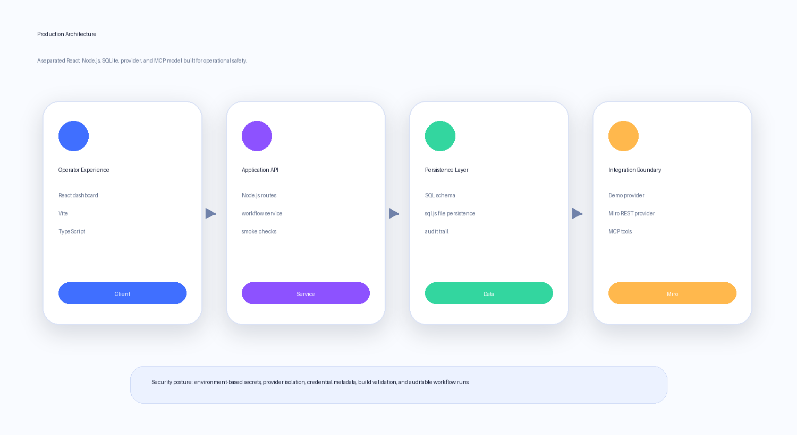
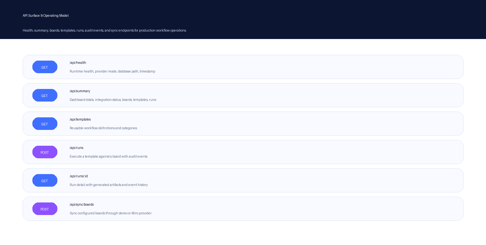
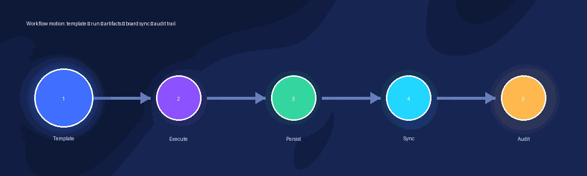

# Miro Workflows


[](https://www.typescriptlang.org/)
[](https://react.dev/)
[](https://vite.dev/)
[](https://nodejs.org/)
[](https://sql.js.org/)
[](https://developers.miro.com/)
[](https://modelcontextprotocol.io/)

**Miro Workflows** is a production-ready TypeScript command center for turning Miro-based collaboration into repeatable workflow operations. It combines a polished React dashboard, Node.js API, SQLite-backed persistence, workflow templates, audit trails, optional live Miro sync, and a custom MCP server for agent-compatible board automation.


## Why it matters

Miro Workflows gives teams a clean operational layer around visual collaboration. Operators can review board state, execute standard templates, inspect generated artifacts, and preserve workflow history without coupling the product experience directly to external API behavior. Miro documents both REST API applications and MCP-enabled automation patterns for extending boards and triggering actions from compatible clients.[1] [2]


| Capability | What it delivers |
| --- | --- |
| **Workflow dashboard** | A focused command center for boards, templates, runs, provider state, and audit activity. |
| **Template execution** | Repeatable sprint planning, product discovery, and incident review workflows. |
| **Persistence layer** | SQLite schema for workspaces, credentials metadata, boards, templates, runs, artifacts, and audit events. |
| **Miro provider boundary** | Demo-first mode by default, with token-backed live sync available through environment configuration. |
| **MCP package** | A Node.js custom MCP server for direct board automation from MCP-compatible clients. |

## Architecture



| Layer | Responsibility | Key paths |
| --- | --- | --- |
| **React dashboard** | Operator UI, workflow controls, run history, and provider visibility. | [`src`](src) |
| **Node.js API** | Health, summary, templates, runs, audit events, and board sync endpoints. | [`server`](server) |
| **SQLite persistence** | Local durable database powered by `sql.js` for easy install and CI validation. | [`server/db/schema.sql`](server/db/schema.sql) |
| **Shared domain model** | Type-safe contracts and production-shaped seed data. | [`shared`](shared) |
| **MCP server** | Direct Miro board tools for compatible agent clients. | [`miro-custom-mcp`](miro-custom-mcp) |

Miro's OAuth and storage guidance recommends server-side environment configuration and durable token storage for production integrations.[3] [4] This repository keeps secrets out of source control, stores credential metadata, and leaves a clean path for future OAuth and managed database upgrades.

## API surface



| Endpoint | Purpose |
| --- | --- |
| `GET /api/health` | Runtime, database, and provider health. |
| `GET /api/summary` | Dashboard totals, boards, templates, runs, and integration status. |
| `GET /api/templates` | Available workflow templates. |
| `POST /api/runs` | Execute a workflow template against a board. |
| `GET /api/runs/:id` | Run detail, generated items, and audit history. |
| `POST /api/sync/boards` | Sync configured boards through the active provider. |

## Quick start

The default setup runs in **demo mode** with no Miro token required.

```bash
pnpm install
pnpm run seed
pnpm run validate
pnpm run smoke
pnpm run dev:api
```

Start the React dashboard in another terminal.

```bash
pnpm run dev:web
```

The dashboard runs at [`http://localhost:5173`](http://localhost:5173), and the API runs at [`http://localhost:8787`](http://localhost:8787). For live Miro sync, copy [`.env.example`](.env.example), set `MIRO_PROVIDER_MODE=miro`, and provide `MIRO_ACCESS_TOKEN`.

## Production checks

| Command | Purpose |
| --- | --- |
| `pnpm run seed` | Seed the local SQLite database. |
| `pnpm run validate` | Verify schema and application state. |
| `pnpm run smoke` | Execute a workflow and provider sync test. |
| `pnpm run typecheck` | Run strict TypeScript checks. |
| `pnpm run build` | Build the React app, Node API, and MCP package. |
| `pnpm run mcp:build` | Build only the custom MCP server. |

## Included workflows



| Template | Outcome |
| --- | --- |
| **Sprint Planning Accelerator** | Prioritization, risks, agenda, and sprint commitments. |
| **Product Discovery Canvas** | User insights, jobs, evidence, experiments, and decisions. |
| **Incident Review Retro** | Timeline, root-cause analysis, corrective actions, and prevention plan. |

## Documentation

| Document | Description |
| --- | --- |
| [`docs/ARCHITECTURE.md`](docs/ARCHITECTURE.md) | Detailed system model, schema, API contract, security posture, and deployment notes. |
| [`docs/SETUP.md`](docs/SETUP.md) | Local development, environment variables, validation, and MCP setup. |
| [`miro-custom-mcp/README.md`](miro-custom-mcp/README.md) | Custom MCP server usage and production guidance. |
| [`.env.example`](.env.example) | Safe defaults and optional live Miro provider configuration. |

## References

[1]: https://developers.miro.com/docs/rest-api-build-your-first-hello-world-app "Miro REST API quickstart"
[2]: https://developers.miro.com/docs/miro-mcp "Miro MCP documentation"
[3]: https://developers.miro.com/docs/miro-nodejs-quickstart-with-oauth-and-express "Miro Node.js quickstart with OAuth and Express"
[4]: https://developers.miro.com/docs/miro-nodejs-implement-storage-for-data-persistence "Miro Node.js data persistence guide"
