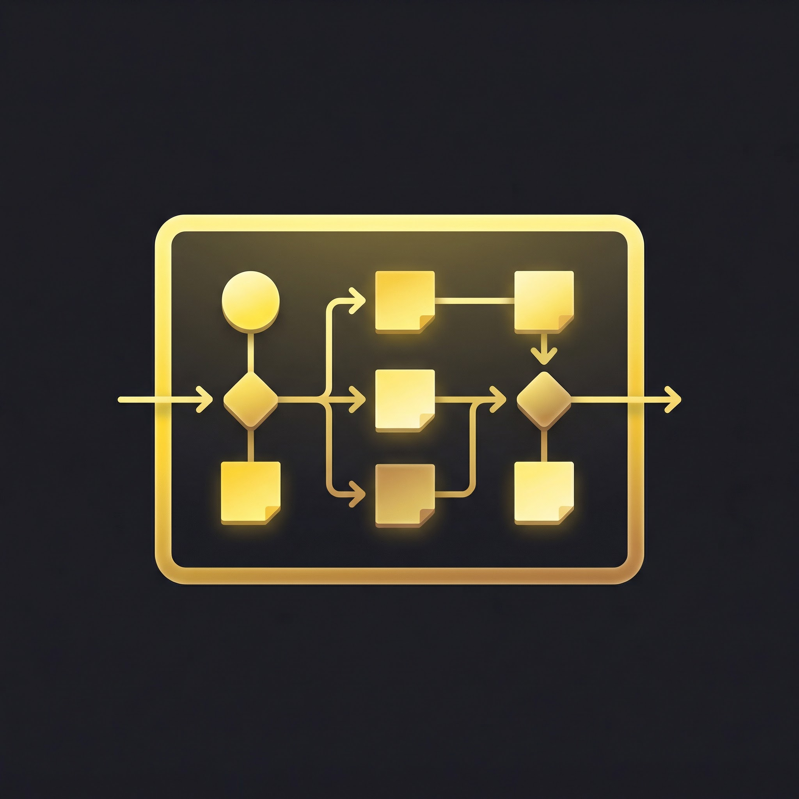
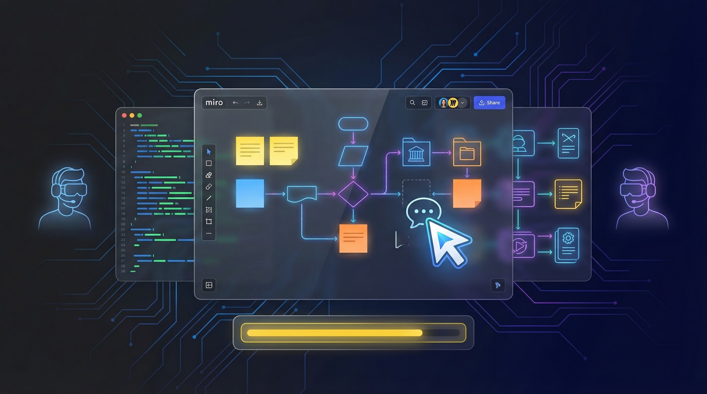

<div align="center">



# Miro Workflows

### Turn Natural Language into Miro Boards

**Describe what you want. AI creates the board. Full MCP integration with Cursor IDE — no drag-and-drop required.**

[](LICENSE)
[](https://www.typescriptlang.org/)
[](https://bun.sh)
[](https://modelcontextprotocol.io)
[](https://miro.com)

[Quick Start](#quick-start) · [Features](#features) · [Custom MCP Server](#custom-mcp-server) · [Prompt Library](#usage-examples) · [Docs](#documentation)

---



</div>

---

## The Problem

Creating Miro boards is manual, repetitive, and slow. Every sprint planning session, architecture review, or retro starts with the same drag-and-drop ritual. And when you need to turn code into a visual diagram, you're stuck switching between your IDE and a whiteboard tool.

## The Solution

Miro Workflows lets you **describe any board in natural language** and creates it instantly through the Model Context Protocol (MCP). It works directly inside Cursor IDE — no context switching, no drag-and-drop. Just describe what you need, and the AI builds it on your Miro board.

The project includes both the **official Miro MCP** integration (zero setup) and a **custom MCP server** that gives you full REST API v2 control with precise positioning, custom colors, all item types, and professional layouts.

> *"Create a sprint planning board with backlog, in-progress, review, and done columns. Add 5 sample user stories."*
>
> Done. Board created. Sticky notes placed. Columns organized.

---

## Features

- **Official Miro MCP Integration** — Connect to Miro's hosted MCP server (zero local setup)
- **Custom MCP Server** — Full REST API v2 control with precise positioning, colors, and all item types
- **AI-Powered Board Creation** — Generate diagrams, workflows, and architecture visualizations using natural language
- **Code ↔ Diagram Conversion** — Transform code into visual diagrams and vice versa
- **Team Collaboration** — Multiple developers working on the same Miro team boards simultaneously
- **Curated Prompt Library** — Pre-built prompts for architecture diagrams, sprint planning, retros, SWOT analysis, and more
- **Validation Tools** — Built-in setup validation script to verify your configuration
- **Full Styling Control** — Custom colors, borders, fills, fonts, sizes, and precise (x, y) positioning

## Quick Start

### Prerequisites

- [Bun](https://bun.sh/) v1.0.0 or higher
- [Git](https://git-scm.com/)
- [Cursor IDE](https://cursor.sh/)
- A Miro account with team workspace access

### Installation

1. **Clone the repository**

```bash
git clone https://github.com/YOUR_USERNAME/miro-workflows.git
cd miro-workflows
```

2. **Install dependencies**

```bash
bun install
```

3. **Validate your setup**

```bash
bun run validate
```

4. **Connect to Miro MCP in Cursor**

- Open Cursor Settings (`Ctrl + ,`)
- Navigate to **Features** → **MCP Servers**
- Find "miro" and click **Connect**
- Complete OAuth authentication
- Select your Miro team

### First Steps

Try this prompt in Cursor to verify your connection:

```
Create a new Miro board called "Test Board" with a simple architecture diagram showing a frontend, backend, and database
```

## Project Structure

```
miro-workflows/
├── .cursor/
│   └── mcp.json              # MCP server configuration
├── docs/
│   ├── SETUP.md              # Detailed setup instructions
│   ├── PROMPTS.md            # Curated prompt library
│   └── WORKFLOWS.md          # Workflow documentation template
├── examples/
│   └── sample_prompts.md     # Ready-to-use example prompts
├── scripts/
│   └── validate_setup.ts     # Environment validation script
├── .env.example              # Environment template
├── .gitignore
├── package.json
├── tsconfig.json
├── bunfig.toml
└── README.md
```

## Documentation

- **[SETUP.md](docs/SETUP.md)**: Complete setup guide for new team members
- **[PROMPTS.md](docs/PROMPTS.md)**: Effective prompts and patterns for Miro MCP
- **[WORKFLOWS.md](docs/WORKFLOWS.md)**: Template for documenting your boards and workflows
- **[sample_prompts.md](examples/sample_prompts.md)**: Copy-paste examples for common scenarios

## Usage Examples

### Generate Architecture Diagram

```
Create a microservices architecture diagram with:
- API Gateway
- Auth Service
- User Service
- Product Service
- PostgreSQL database
- Redis cache
```

### Convert Code to Diagram

```
Analyze this repository [github-url] and create a class diagram showing component relationships
```

### Generate Code from Board

```
Based on the API design at [miro-board-url], generate FastAPI endpoints with Pydantic models
```

### Create Sprint Board

```
Create a sprint planning board with Backlog, In Progress, Review, and Done columns. Add 5 sample user stories.
```

## Collaboration Workflow

### For Team Members

1. Both developers authenticate with their own Miro accounts
2. Select the **same Miro team** during OAuth
3. Create and edit boards collaboratively
4. Document boards in `docs/WORKFLOWS.md`
5. Use conventional commits when pushing changes

### Git Workflow

```bash
# Pull latest changes
git pull origin main

# Create feature branch
git checkout -b feature/new-workflow

# Make changes and commit (use conventional commits)
git commit -m "feat(docs): add new workflow template"

# Push and create PR
git push origin feature/new-workflow
```

### Conventional Commits

This project follows [Conventional Commits](https://www.conventionalcommits.org/):

- `feat:` New features
- `fix:` Bug fixes
- `docs:` Documentation changes
- `chore:` Maintenance tasks
- `refactor:` Code refactoring
- `test:` Test updates

Examples:
```bash
git commit -m "feat(prompts): add database schema generation prompts"
git commit -m "fix(scripts): resolve validation script path issue"
git commit -m "docs: update setup guide with troubleshooting steps"
```

## Scripts

| Command | Description |
|---------|-------------|
| `bun run validate` | Validate development environment setup |
| `bun install` | Install dependencies |

## Capabilities

The official Miro MCP server supports:

| Feature | Description |
|---------|-------------|
| **Generate Diagrams** | Create system architecture, workflows, ERDs, and more |
| **Generate Code** | Convert diagrams and PRDs into working code |
| **Read Board Context** | AI can analyze existing boards |
| **OAuth 2.1 Security** | Enterprise-grade authentication |
| **Team Collaboration** | Multiple users on same team boards |

## Supported AI Clients

- Cursor ✓
- Claude Code
- VSCode + GitHub Copilot
- Gemini CLI
- Lovable
- Replit
- Windsurf
- And more MCP-compatible clients

## Troubleshooting

### Connection Issues

**Problem**: Cannot connect to Miro MCP

**Solutions**:
1. Verify network access to `https://mcp.miro.com/`
2. Update Cursor to latest version
3. Disconnect and reconnect MCP server

### Team Selection Error

**Problem**: Cannot access boards or permission denied

**Solution**: Re-authenticate and ensure you select the correct Miro team (must match your collaborator's team)

### OAuth Token Expired

**Solution**: Disconnect and reconnect in Cursor Settings → MCP Servers

For more troubleshooting, see [docs/SETUP.md](docs/SETUP.md).

## Resources

- [Official Miro MCP Documentation](https://developers.miro.com/docs/miro-mcp)
- [MCP Introduction](https://developers.miro.com/docs/mcp-intro)
- [Miro MCP Tools & Prompts](https://developers.miro.com/docs/miro-mcp-prompts)
- [Miro Developer Community](https://community.miro.com/developer-platform-and-apis-57)

## Security

- OAuth 2.1 authentication
- No API keys stored in repository
- Enterprise-grade security from Miro
- Permission-based board access
- Rate limiting protection

## Contributing

1. Fork the repository
2. Create a feature branch
3. Make your changes
4. Follow conventional commits
5. Submit a pull request

## License

MIT License - see LICENSE file for details

## Support

- Open an issue for bugs or feature requests
- Check [docs/SETUP.md](docs/SETUP.md) for setup help
- Review [docs/PROMPTS.md](docs/PROMPTS.md) for usage guidance

## Custom MCP Server

The official Miro MCP only creates basic flowchart diagrams. The included custom MCP server (`miro-custom-mcp/`) gives you full control:

| Capability | Official MCP | Custom MCP Server |
|---|---|---|
| Basic flowcharts | Yes | Yes |
| Precise (x, y) positioning | No | Yes |
| Custom hex colors | No | Yes |
| Sticky notes, shapes, frames, cards | Limited | Full |
| Update and delete items | No | Yes |
| Professional layouts (SWOT, dashboards) | No | Yes |
| Full border/fill/font styling | No | Yes |

See [miro-custom-mcp/README.md](./miro-custom-mcp/README.md) for setup instructions.

---

## Roadmap

- [ ] Template marketplace for common board layouts
- [ ] Automated board-to-code generation pipeline
- [ ] Real-time board sync with Git commits
- [ ] VS Code extension (beyond Cursor)
- [ ] Board versioning and diff visualization
- [ ] Slack/Discord bot for board creation

---

<div align="center">

**Built by [Alex Cinovoj](https://github.com/Alexi5000) · [TechTide AI](https://github.com/Alexi5000)**

*Stop dragging. Start describing.*

</div>
