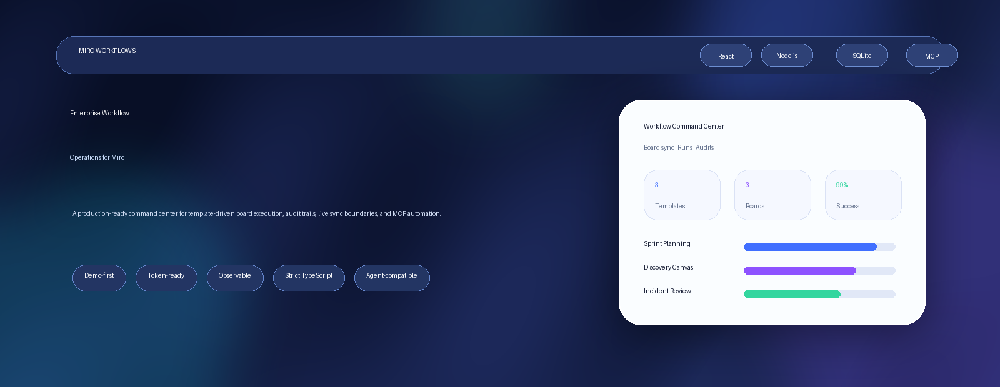
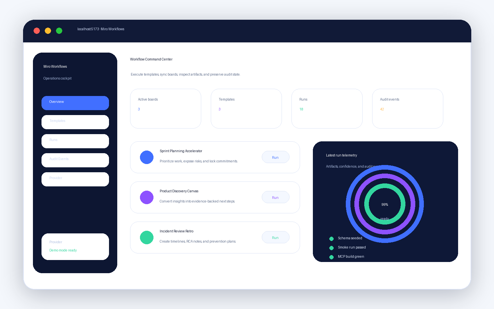
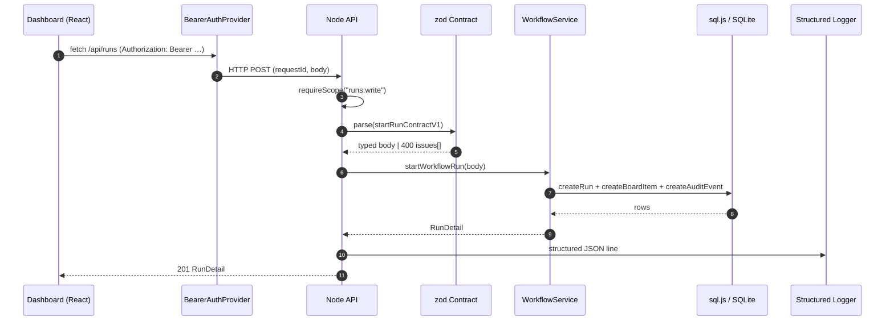
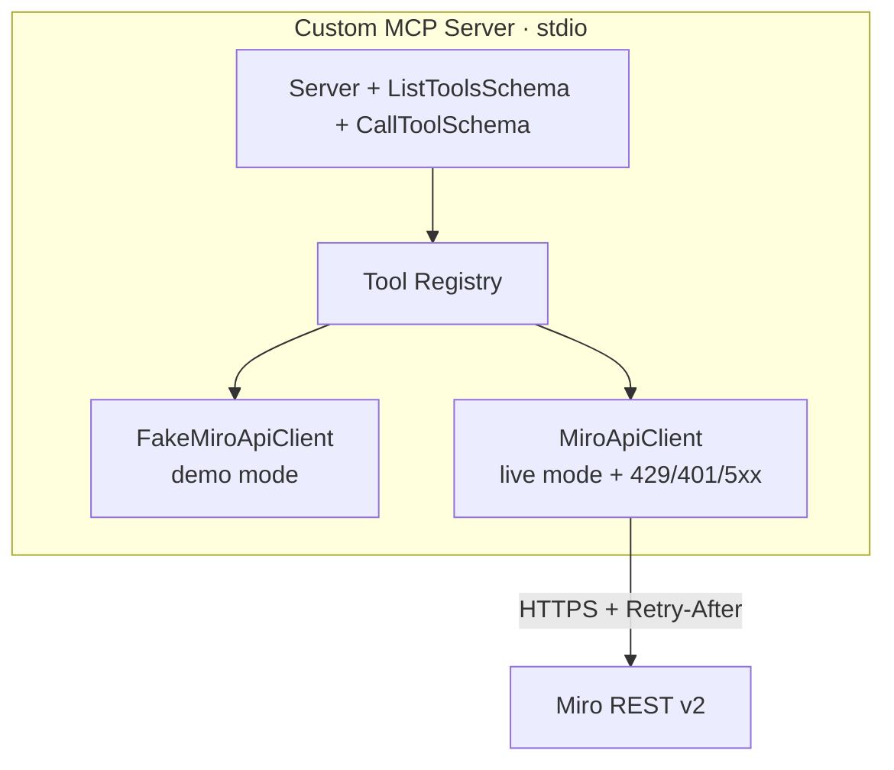
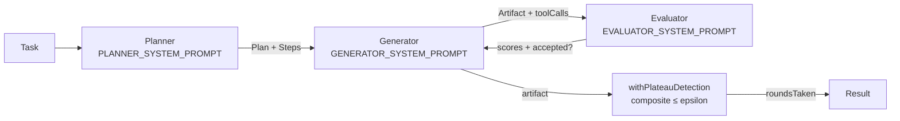

<div align="center">

<a href="https://github.com/Alexi5000/miro-workflows">
  <picture>
    <source media="(prefers-color-scheme: dark)" srcset="assets/readme/hero.png" />
    
  </picture>
</a>

# Miro Workflows

[](https://github.com/Alexi5000/miro-workflows/releases/tag/v1.0.0)
[](https://www.typescriptlang.org/)
[](https://nodejs.org)
[](https://react.dev)
[](https://vite.dev)
[](https://sql.js.org)
[](https://modelcontextprotocol.io)
[](https://www.docker.com)
[](LICENSE)
[](./ROADMAP.md)
[](./docs/ARCHITECTURE.md)

**Production-grade Miro command center: React dashboard, Node API, custom MCP server,
typed contracts, three-agent planning harness, OAuth device flow, Prometheus metrics, and a
full Docker stack — all in one FDE-grade repo.**

</div>

---

## ✨ What it does

Miro Workflows turns visual collaboration into **repeatable operations** for product,
engineering, and ops teams. It gives you:

- A **React dashboard** (`/dashboard`, `/workspaces`, `/boards`, `/boards/:id`, `/credentials`)
  with hash routing, error boundary, and bearer-auth context.
- A **Node HTTP API** (raw `node:http` + zod) with a **bearer-token auth wall**, 1 MiB
  body cap, structured access logs, **Prometheus `/metrics`**, and a webhook endpoint
  with HMAC-SHA256 + idempotent dedupe.
- A **custom MCP server** with **20 tools** (boards + items + composite) over stdio,
  with rate-limit-aware retry, numeric + HTTP-date `Retry-After` parsing, and a
  `FakeMiroApiClient` for offline development.
- A **three-agent planning harness** (Planner → Generator → Evaluator) with a
  four-axis grader and a composable plateau detector, fully model-agnostic.
- **Typed, versioned contracts** (`shared/contracts/`) — zod, JSON-Schema
  artifacts, OpenAPI 3.1, all generated from the same source.
- **Reproducible bench** with honest "what we DID NOT measure" disclosures.
- **Three multi-stage Dockerfiles** + `docker-compose.yml` that builds and runs cleanly.


---

## 🖼️ Dashboard preview



---

## 🏗️ Architecture

```mermaid
flowchart LR
  subgraph Client
    UI[React 18 + Vite SPA<br/>hash router · ErrorBoundary · AuthProvider]
  end
  subgraph MCP[Model Context Protocol]
    Agent[Claude / codex / Cursor / etc.]
  end
  subgraph Server[Node HTTP API · raw node:http]
    Auth[bearer auth wall<br/>scope-bounded]
    Val[zod contracts<br/>body-size cap 1 MiB]
    Log[structured access log]
    Met[/metrics Prometheus]
    Web[/api/webhooks/miro<br/>HMAC + dedupe]
    Svc[services: workflowService, authService]
  end
  Repo[(sql.js<br/>file-backed SQLite)]
  Miro[Miro REST v2]

  UI -- "GET /api/*<br/>Bearer token" --> Auth
  Agent -- "stdio<br/>20 tools" --> Svc
  Auth --> Val
  Val --> Svc
  Svc --> Repo
  Svc -- "live mode" --> Miro
  Web -- "HMAC verify" --> Svc
  Log -.-> stdout[JSON access log]
  Met -.-> scraper[Prometheus / Grafana]
```

### End-to-end request lifecycle



### MCP server (20 tools)



---

## 🧰 The 20 MCP tools

Boards & items (CRUD + composite):

| Boards | Items | Composite |
| --- | --- | --- |
| `list_boards` | `create_sticky_note` | `batch_create_items` |
| `create_board` | `create_shape` | `export_board` |
| `get_board` | `create_frame` | `search_items` |
| `update_board` | `create_text` | |
| `delete_board` | `create_card` | |
| `list_board_members` | `create_connector` | |
| `list_subscriptions` | `create_image` | |
| | `get_board_items` | |
| | `update_item` | |
| | `delete_item` | |

All schemas live in `miro-custom-mcp/src/tools/`. Add a new tool = one file plus one
registry line (see `.agents/skills/mcp-tool-authoring/SKILL.md`).

---

## 🚦 Three-agent planning harness



- **`Planner`** turns a free-form task into a `Plan` with checkable `acceptance[]` per step.
- **`Generator`** emits an `Artifact` + `toolCalls` (re-uses Evaluator feedback next round).
- **`Evaluator`** scores each axis in `[0, 1]` (`correctness` / `safety` / `completeness` / `quality`).
- **`withPlateauDetection(scorer, opts)`** wraps any scorer with sliding-window
  plateau detection (epsilon / regression / converged).
- **Model-agnostic.** Any `(messages) => Promise<string>` works — stub it for CI,
  point it at Claude or codex in production.

Demo invocation:

```bash
pnpm run agent:run -- "Build a sprint planning board with 6 columns"
```

---

## 🚀 Quick start

```bash
git clone https://github.com/Alexi5000/miro-workflows.git
cd miro-workflows
pnpm install
cp .env.example .env
pnpm run seed        # seeds workspaces, credentials, boards, templates
pnpm run dev:api     # http://localhost:8787
pnpm run dev:web     # http://localhost:5173
```

The dashboard is at <http://localhost:5173>; the API at <http://localhost:8787>; `/api/health`,
`/api/summary`, `/metrics` are open. Every write endpoint requires a bearer token —
issue one via `POST /api/auth/tokens` (see [SECURITY.md](./SECURITY.md)).

### Live Miro (optional)

```bash
MIRO_PROVIDER_MODE=miro MIRO_ACCESS_TOKEN=your-token pnpm run dev:api
```

For OAuth device flow wiring (currently a demo stub), see [`docs/OAUTH.md`](./docs/OAUTH.md).

### Docker

```bash
docker compose up --build    # web :5173, api :8787, mcp stdio
docker compose down -v
```

---

## 🛠️ Useful commands

| Command | Purpose |
| --- | --- |
| `pnpm test` | Root vitest suite (server, contracts, agents, scripts) |
| `pnpm run test:ui` | jsdom tests + full-stack e2e |
| `pnpm run coverage` | v8 coverage; 80/65/80/80 thresholds |
| `pnpm run typecheck` | Strict TS, 0 errors |
| `pnpm run ci` | typecheck + contracts + tests + test:ui + smoke + validate |
| `pnpm run bench` | Reproducible HTTP + harness numbers → `docs/BENCHMARK.md` |
| `pnpm run openapi:build` | Generate `docs/openapi.json` |
| `pnpm run contracts:build` | Generate JSON-Schema artifacts |
| `pnpm run agent:run -- "task"` | Run the three-agent harness end-to-end |
| `pnpm run mcp:test` | Run the MCP package vitest suite |
| `pnpm run validate` | File-presence + seed-sanity check |
| `docker compose config -q` | Compose lint (exit 0 = clean) |

---

## 📊 Latest benchmark (n=20, commit `63372d0`)

| Surface | Measurement | p50 | p95 |
| --- | --- | ---: | ---: |
| HTTP | `GET /api/health` | 1.0 ms | 1.8 ms |
| HTTP | `GET /api/summary` | 1.6 ms | 3.3 ms |
| HTTP | `GET /api/templates` | 0.7 ms | 1.4 ms |
| HTTP | `POST /api/runs` | 10.2 ms | 14.5 ms |
| Harness | `agent harness (1 step)` | 0.1 ms | 0.1 ms |
| MCP | `batch_create_items(10)` | 139.3 ms | 141.9 ms |

Full results + the "what we did NOT measure" list are in [`docs/BENCHMARK.md`](./docs/BENCHMARK.md).

---

## 🧪 Tests — 116 green

| Suite | Count | Runner |
| --- | ---: | --- |
| Root (server, contracts, agents, scripts) | 69 | `vitest` |
| UI + full-stack e2e (jsdom) | 13 | `vitest` + `@testing-library/react` |
| MCP package | 34 | `vitest` |
| **Total** | **116** | |

`pnpm run ci` runs them all in CI (`.github/workflows/ci.yml`).

---

## 📁 Repository layout

```
.
├── .agents/skills/      Authoring-time skills for coding agents
├── docs/
│   ├── ARCHITECTURE.md  Layered system model
│   ├── SETUP.md         Local + Docker setup, env vars
│   ├── BENCHMARK.md     Reproducible bench + honest gaps
│   ├── CONTRACTS.md     Typed, versioned sprint / audit / run contracts
│   ├── MCP-TOOLS.md     All 20 MCP tools
│   ├── OAUTH.md         OAuth device-flow status (currently demo stub)
│   ├── SKILLS.md        How to author .agents/skills/
│   ├── TESTING.md       Coverage policy + how to add tests
│   ├── adr/             Nygard-template ADRs (0001–0010)
│   └── internal/        Sprint plans, internal docs
├── miro-custom-mcp/     Standalone pnpm package; 20 tools + FakeMiroApiClient + bench + tests
├── notebooks/           Human-authored decision logs
├── scripts/             validate, smoke, bench, contracts, openapi generator, contract checks
├── server/              Raw node:http API + zod-contract validation
│   ├── bootstrap.ts     startServer, structured access log, auth wall, /metrics, /webhooks/miro
│   ├── db/              sql.js + schema.sql + repository
│   ├── services/        workflowService, authService (HMAC-SHA256 bearer tokens)
│   └── metrics.ts       Prometheus counters and histograms
├── shared/contracts/     Versioned zod schemas + zod-to-json-schema builders + re-exports
├── src/                 React 18 + Vite + hash router + AuthProvider + ErrorBoundary
├── tests/
│   ├── api.test.ts      HTTP API integration
│   ├── ui/              jsdom render tests
│   ├── e2e/             full-stack e2e
│   └── dom-setup.ts     jest-dom matchers
├── AGENTS.md            Procedural memory for coding agents
├── CONTRIBUTING.md      PR template, code review checklist
├── ROADMAP.md           Public v1.0 → v1.5 forward-looking plan
├── SECURITY.md         Vulnerability disclosure + hardening status
├── docker-compose.yml   web + api + mcp
├── Dockerfile.{web,api,mcp}
└── package.json         pnpm 10.11.1, Node 20+
```

---

## 📚 Documentation

| File | What's in it |
| --- | --- |
| [AGENTS.md](./AGENTS.md) | Procedural memory for coding agents |
| [ROADMAP.md](./ROADMAP.md) | v1.0 → v1.5 forward-looking plan |
| [SECURITY.md](./SECURITY.md) | Vulnerability disclosure + production hardening |
| [CONTRIBUTING.md](./CONTRIBUTING.md) | PR template, code review checklist |
| [docs/ARCHITECTURE.md](./docs/ARCHITECTURE.md) | Layered system model + API contract + UI routing |
| [docs/BENCHMARK.md](./docs/BENCHMARK.md) | Reproducible bench + honest gaps |
| [docs/CONTRACTS.md](./docs/CONTRACTS.md) | Versioned contracts policy |
| [docs/MCP-TOOLS.md](./docs/MCP-TOOLS.md) | All 20 tools |
| [docs/OAUTH.md](./docs/OAUTH.md) | OAuth device-flow status (currently demo stub) |
| [docs/SKILLS.md](./docs/SKILLS.md) | Authoring-time skills |
| [docs/TESTING.md](./docs/TESTING.md) | Coverage policy |
| [docs/openapi.json](./docs/openapi.json) | Generated OpenAPI 3.1 spec (run `pnpm run openapi:build`) |
| [docs/adr/](./docs/adr/) | Architecture Decision Records (10 ADRs) |
| [.agents/skills/](./.agents/skills/) | miro-board-design · mcp-tool-authoring · fde-pillar-review |

---

## 🔐 Security

See [SECURITY.md](./SECURITY.md). The foundation ships with:

- Body-size cap 1 MiB (returns 413).
- Safe `JSON.parse` (returns 400 with structured `issues[]`).
- Sanitized 500 responses (server logs the full error, client gets a generic message).
- Bearer-token auth wall on every write endpoint.
- HMAC-SHA256 webhook verification with idempotent dedupe.
- Token storage: HMAC digest + 8-char prefix, never plaintext.
- Structured access log with `requestId` correlation.

> Reporting: `security@<your-domain>` (private key in `SECURITY.md`).

---

## 🚢 Production readiness

| Surface | Status |
| --- | --- |
| Tests | **116/116 green** (root 69, UI 13, MCP 34) |
| Typecheck | 0 errors |
| Coverage thresholds | lines 80 / branches 65 / fns 80 / stmts 80 |
| Dockerfiles | `web`, `api`, `mcp` all build OK |
| `docker compose config -q` | ✅ |
| Bench | reproducible, n=20, real numbers in `docs/BENCHMARK.md` |
| CI | `.github/workflows/ci.yml` runs the full gate |
| Auth | bearer + scope-bounded; tokens never stored as plaintext |
| OpenAPI 3.1 | `docs/openapi.json` (run `pnpm run openapi:build`) |

> **Next-stop for full production launch** ([ROADMAP.md](./ROADMAP.md) v1.1): real OAuth
> device-flow + token exchange, Postgres + Drizzle ORM pivot, OpenTelemetry spans,
> Helm chart + GHCR signed images.

---

## 📜 License

[MIT](./LICENSE) — © 2026 TechTide. See [SECURITY.md](./SECURITY.md) for vulnerability
disclosure.
